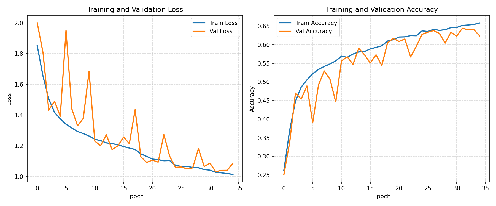

# Analiza emocji twarzy na zdjeciach

Srednio zaawansowany projekt rozpoznawania emocji twarzy. Aplikacja wykrywa twarz na obrazie lub z kamery, wycina obszar twarzy i klasyfikuje emocje przy pomocy wlasnego modelu CNN.

Projekt jest celowo utrzymany na srednim poziomie trudnosci: bez ciezkiego transfer learningu i bez wieloetapowego fine-tuningu. Model jest prosty do wyjasnienia, a trening na GPU powinien miescic sie w rozsadnym czasie.

## Funkcje

- trening wlasnego modelu CNN,
- automatyczny validation split z `data/train`,
- finalna ewaluacja na osobnym `data/test`,
- raport klasyfikacji i macierz pomylek,
- predykcja emocji na pojedynczym zdjeciu,
- aplikacja webowa FastAPI z kamera,
- preprocessing twarzy wspolny dla treningu, ewaluacji i predykcji.

### Historia treningu

Poniżej wykres loss/accuracy z treningu:



## Struktura

```text
.
|-- app.py                              # backend FastAPI aplikacji webowej
|-- model_definition.py                 # architektura modelu CNN
|-- train.py                            # trening modelu
|-- evaluate.py                         # ewaluacja na data/test
|-- predict_image.py                    # predykcja na pojedynczym zdjeciu
|-- prepare_data.py                     # pomocnicze tworzenie struktury danych
|-- requirements.txt                    # zaleznosci Pythona
|-- INSTRUKCJA_MODELU.txt               # dokladniejsza instrukcja pracy
|-- haarcascade_frontalface_default.xml # lokalny detektor twarzy OpenCV
|-- utils/
|   `-- helpers.py                      # stale, preprocessing, funkcje pomocnicze
|-- templates/                          # HTML aplikacji
|-- static/                             # CSS/JS aplikacji
|-- data/                               # dataset, ignorowany przez git
|-- models/                             # zapisane modele, ignorowane przez git
`-- reports/                            # raporty i wykresy, ignorowane przez git
```

## Model

Model `FER_Medium_CNN` pracuje na:

- obrazach grayscale,
- rozmiarze `48x48`,
- 7 klasach emocji:
  - `angry`,
  - `disgust`,
  - `fear`,
  - `happy`,
  - `neutral`,
  - `sad`,
  - `surprise`.

Architektura uzywa:

- blokow `Conv2D`,
- `BatchNormalization`,
- `MaxPooling2D`,
- `Dropout`,
- `GlobalAveragePooling2D`,
- klasyfikatora `Dense`.

## Przygotowanie srodowiska

Aktywuj lokalne srodowisko:

```powershell
.\.venv\Scripts\activate
```

Zainstaluj zaleznosci, jesli nie sa jeszcze zainstalowane:

```powershell
pip install -r requirements.txt
```

## Dane

Dataset powinien miec taka strukture:

```text
data/
|-- train/
|   |-- angry/
|   |-- disgust/
|   |-- fear/
|   |-- happy/
|   |-- neutral/
|   |-- sad/
|   `-- surprise/
`-- test/
    |-- angry/
    |-- disgust/
    |-- fear/
    |-- happy/
    |-- neutral/
    |-- sad/
    `-- surprise/
```

`data/train` sluzy do treningu. Validation jest automatycznie wydzielane z `data/train`.

`data/test` nie jest uzywane podczas treningu. Sluzy tylko do finalnej ewaluacji.

## Trening

```powershell
python train.py
```

Po treningu powstaja:

```text
models/best_model.keras
models/best_model.h5
reports/training_log.csv
reports/training_history.json
reports/training_history.png
reports/training_config.json
reports/validation_classification_report.txt
```

## Ewaluacja

Po treningu uruchom:

```powershell
python evaluate.py
```

Ewaluacja korzysta tylko z `data/test`.

Wyniki:

```text
reports/classification_report.txt
reports/confusion_matrix.png
```

## Predykcja pojedynczego zdjecia

```powershell
python predict_image.py --image "sciezka\do\zdjecia.jpg"
```

Mozesz zmienic margines wokol wykrytej twarzy:

```powershell
python predict_image.py --image "sciezka\do\zdjecia.jpg" --margin 0.20
```

## Aplikacja webowa

Uruchom backend:

```powershell
python -m uvicorn app:app --host 127.0.0.1 --port 8002 --reload
```

Otworz:

```text
http://127.0.0.1:8002
```

Zatrzymanie serwera:

```powershell
Ctrl + C
```

## Co jest ignorowane przez git

Repozytorium nie powinno zawierac:

- `.venv/`,
- `data/`,
- `models/`,
- `reports/`,
- `logs/`,
- cache Pythona,
- plikow IDE i systemowych.

Te elementy sa wpisane w `.gitignore`, bo sa lokalne, duze albo generowane automatycznie.

## Dodatkowa instrukcja

Dokladniejszy opis pracy krok po kroku znajduje sie w:

```text
INSTRUKCJA_MODELU.txt
```
